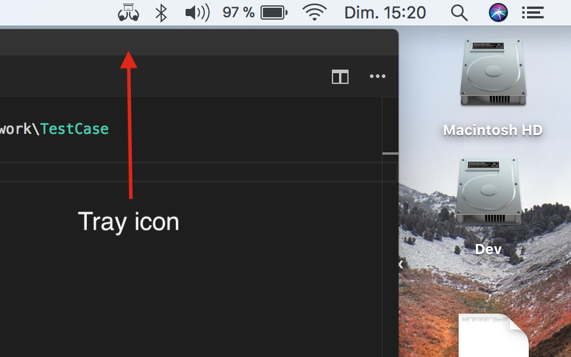
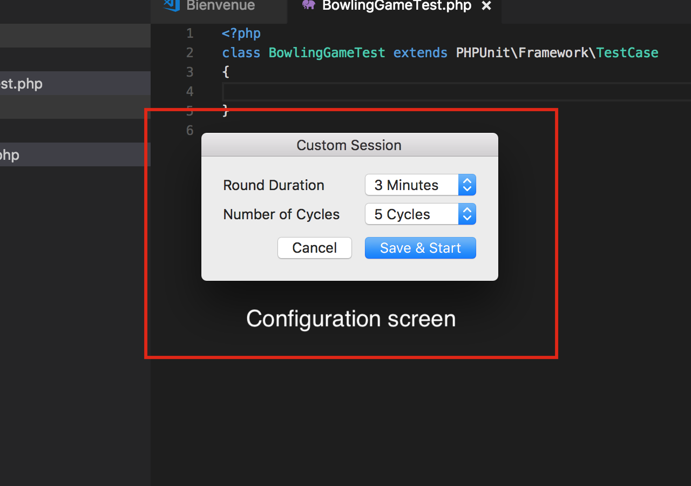
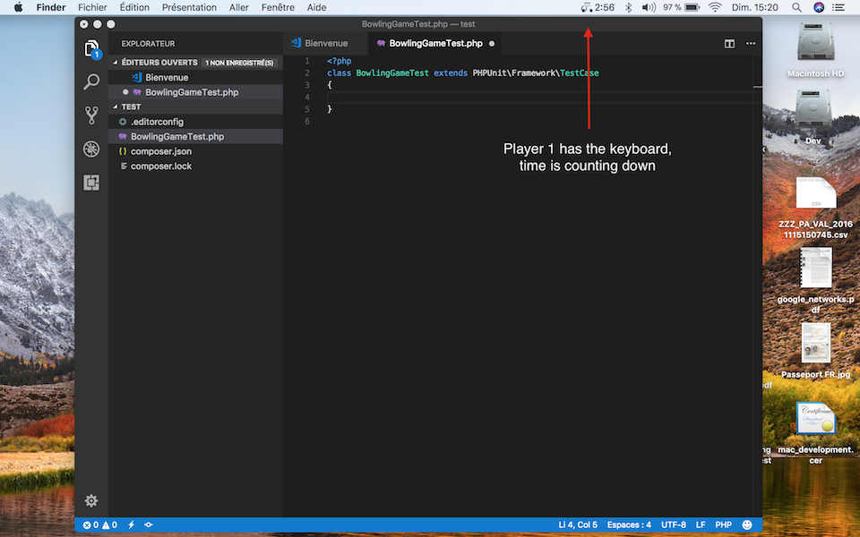
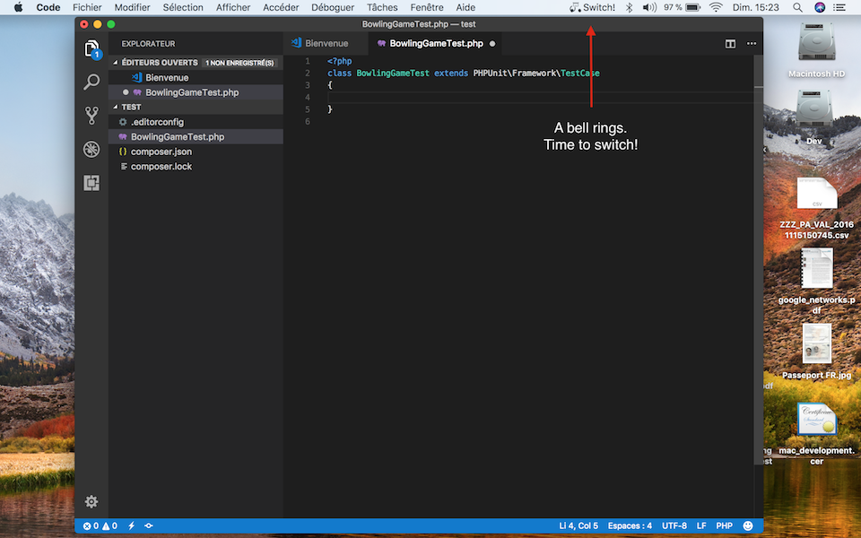

# PairProgram

A timer in your Mac tray to pair program easily.

### Optional configuration

### Counting down!

### Time to switch!

## Keyboard Shortcuts

 - Start / Continue / Resume : Alt+G
 - Pause / Resume : Alt+P
 - End: Alt+E

## Support
Email me at foucauld.degeorges@gmail.com if you encounter issues or if you have ideas for improvement.

## Changelog

 - 1.2: adds notifications and French translation
 - 1.1: improve config screen, add keyboard shortcuts
 - 1.0: initial release
