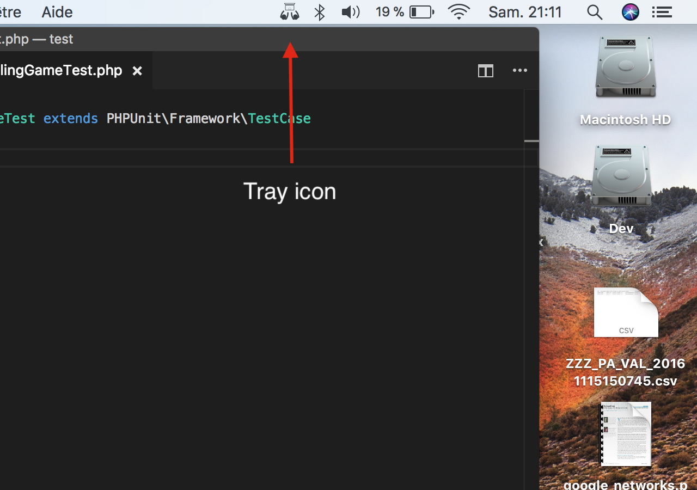
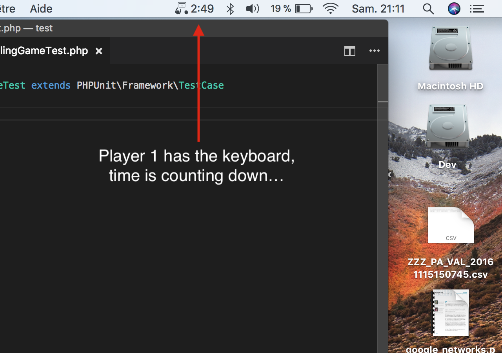

# PairProgram

A timer in your Mac tray to pair program easily

### Optional configuration

### Counting down!

### Time to switch!

## Support
Email me at foucauld.degeorges@gmail.com if you encounter issues or if you have ideas for improvement.

## Changelog

 - 1.0.0: initial release!

## Coming up

 - keyboard shortcuts to start, continue, pause, and end the timer
 - whatever user feedback says ;)
